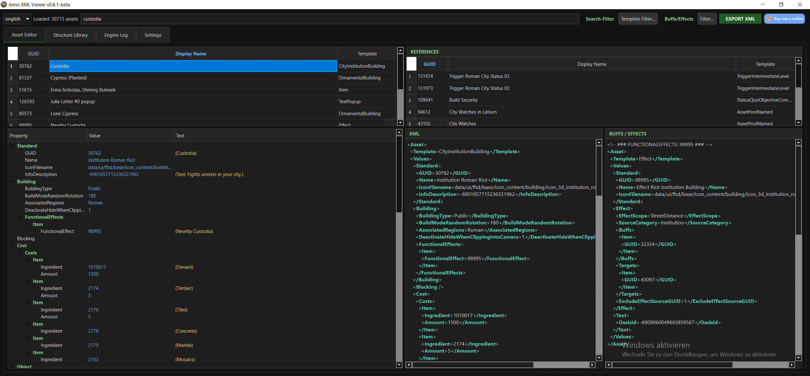

# Anno XML Viewer

## English Version (Deutsche Version unterhalb)

**Anno XML Viewer** is a specialized utility tool designed for modders and data analysts of the *Anno* game series. It simplifies the process of navigating, analyzing, and exploring complex game data by providing a clean, searchable interface for XML assets.

### Key Features
* **Advanced Search:** Instantly locate any asset by searching for its **Name** or **GUID**.
* **Comprehensive Asset Insights:** Selecting an asset automatically reveals all its associated **references**, **effects**, and **buffs** in a structured view.
* **Smart Template Filtering:** Narrow down your search by filtering assets to display only those belonging to a specific template.
* **Data Export:** Easily export complete XML data—including all active effects and buffs (if applicable)—for external use or modding.

### Project Description
> **Anno XML Tool** is a lightweight, intuitive tool designed to streamline data exploration for *Anno* modders. Instead of digging through massive, disorganized XML files, this tool allows you to search for assets instantly using their **Name** or **GUID**. 
> 
> Once an asset is selected, the program dynamically maps out its entire ecosystem, displaying all connected **references**, **buffs**, and **effects** at a glance. With built-in **template filters**, you can isolate specific categories of assets effortlessly. Need to use the data elsewhere? The application features a comprehensive **export function** that packs the full XML data, along with its effects and buffs, into a clean file ready for your next modding project.

### Feature Overview
| Feature | Description |
| :--- | :--- |
| **Search Modes** | By Asset Name or unique GUID |
| **Relational Views** | Automatic display of references, effects, and buffs |
| **Filtering** | Filter by specific asset templates |
| **Export** | Full XML dump including active buffs/effects |

## Support

If this tool helps you, I would appreciate a coffee!

 

*Note: This is a fan project and is not affiliated with Ubisoft.*

---

## Deutsche Version

**Anno XML Viewer** ist ein spezialisiertes Utility-Tool, das für Modder und Datenanalysten der *Anno*-Spieleserie entwickelt wurde. Es vereinfacht das Navigieren, Analysieren und Exportieren komplexer Spieldaten, indem es eine übersichtliche und durchsuchbare Benutzeroberfläche für XML-Assets bereitstellt.

### Hauptfunktionen
* **Erweiterte Suche:** Finden Sie jedes Asset im Handumdrehen durch die Suche nach dem **Namen** oder der **GUID**.
* **Umfassende Asset-Einblicke:** Bei Auswahl eines Assets werden automatisch alle damit verknüpften **Referenzen (References)**, **Effekte (Effects)** und **Buffs** in einer strukturierten Ansicht angezeigt.
* **Intelligente Template-Filterung:** Grenzen Sie Ihre Suche präzise ein, indem Sie über Filter festlegen, dass nur Assets eines bestimmten Templates angezeigt werden.
* **Datenexport:** Exportieren Sie mühelos die vollständigen XML-Daten – einschließlich aller aktiven Effekte und Buffs (falls vorhanden) – für die externe Weiterverwendung oder das Modding.

### Projektbeschreibung
> **Anno XML Viewer** ist ein leichtgewichtiges, intuitives Tool, das die Datenanalyse für *Anno*-Modder rationalisiert. Anstatt sich durch riesige, unübersichtliche XML-Dateien zu wühlen, ermöglicht dieses Programm das sofortige Aufspüren von Assets anhand ihres **Namens** oder ihrer **GUID**. 
> 
> Sobald ein Asset ausgewählt ist, bildet das Programm dynamisch dessen gesamtes Ökosystem ab und zeigt alle verbundenen **Referenzen**, **Buffs** und **Effekte** auf einen Blick. Mit den integrierten **Template-Filtern** lassen sich gezielt bestimmte Asset-Kategorien isolieren. Sie benötigen die Daten für andere Zwecke? Die Anwendung verfügt über eine umfassende **Exportfunktion**, die die kompletten XML-Daten inklusive aller Effekte und Buffs in eine saubere Datei für Ihr nächstes Modding-Projekt packt.

### Funktionsübersicht
| Funktion | Beschreibung |
| :--- | :--- |
| **Suchmodi** | Nach Asset-Name oder eindeutiger GUID |
| **Relationale Ansicht** | Automatische Anzeige von Referenzen, Effekten und Buffs |
| **Filterung** | Filtern nach spezifischen Asset-Templates |
| **Export** | Vollständiger XML-Dump inklusive aktiver Buffs/Effekte |

## Support

Wenn dir dieses Tool hilft, freue ich mich über einen Kaffee!

 

*Hinweis: Dies ist ein Fan-Projekt und steht in keiner Verbindung zu Ubisoft.*